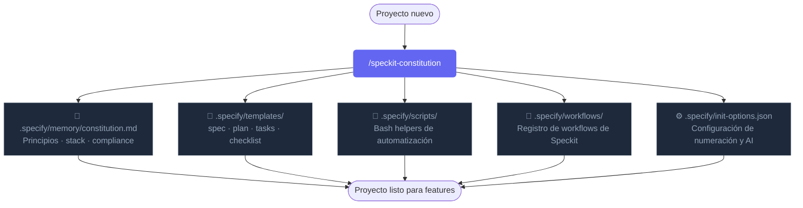
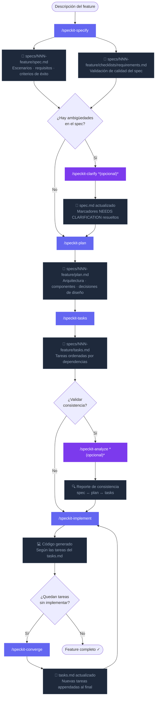

# Speckit Workflow

## 1 — Inicializar un proyecto nuevo

Ejecutar una sola vez por proyecto para establecer los principios, el stack y las restricciones que guiarán todos los features.

---

## 2 — Ciclo de un feature nuevo

Repetir para cada feature. Los pasos marcados *(opcional)* se pueden saltear si el artefacto anterior ya está completo y sin ambigüedades.

---

## Resumen de comandos y artefactos

| Comando | Artefacto generado | Obligatorio |
|---|---|:---:|
| `/speckit-constitution` | `.specify/memory/constitution.md`, templates, scripts | Una vez |
| `/speckit-specify` | `specs/NNN/spec.md`, `checklists/requirements.md` | ✅ |
| `/speckit-clarify` | `spec.md` actualizado | Opcional |
| `/speckit-plan` | `specs/NNN/plan.md` | ✅ |
| `/speckit-tasks` | `specs/NNN/tasks.md` | ✅ |
| `/speckit-analyze` | Reporte de consistencia en consola | Opcional |
| `/speckit-implement` | Código fuente | ✅ |
| `/speckit-converge` | `tasks.md` con tareas faltantes appendadas | Si hay deuda |
